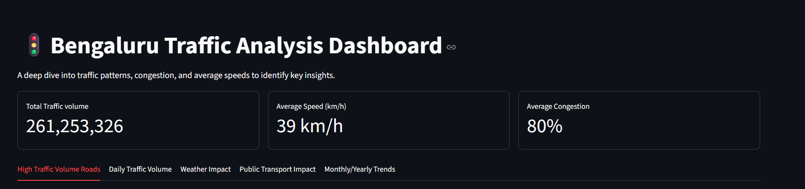
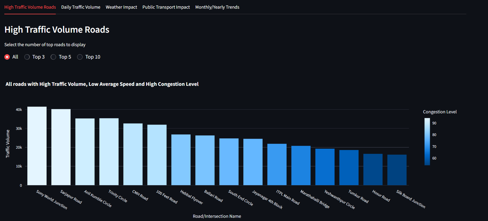
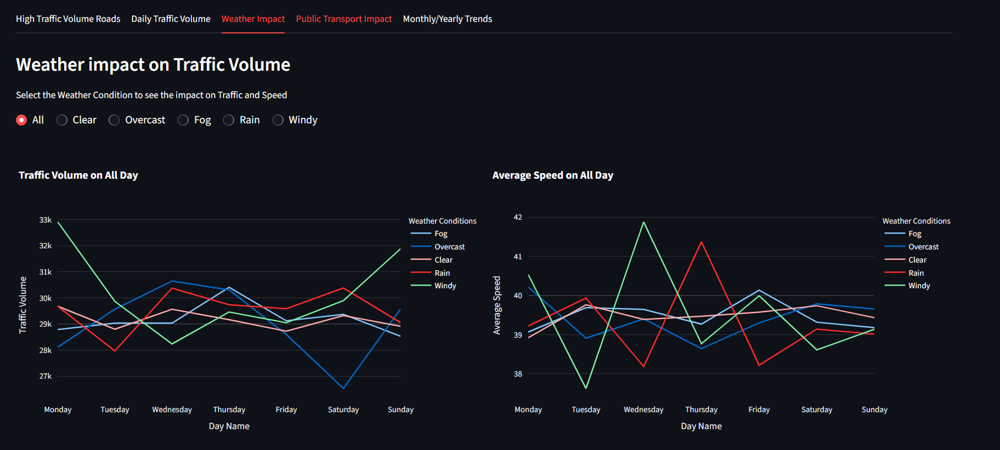
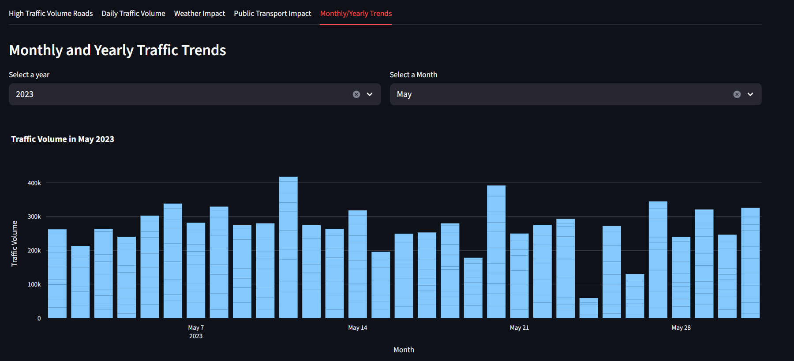

# Bengaluru Traffic Analysis Dashboard

## Project Overview

An interactive data analysis & visualization project exploring traffic, average speed and congestion patterns in Bengaluru. 

This project identifies high-congestion hotspots, best-performing routes, and analyzes daily, weather-based, and monthly traffic trends using an interactive Streamlit dashboard provides a comprehensive look at traffic volume, average speeds, and congestion levels, with insights derived from a detailed analysis of traffic data from 2022 to 2024.

The primary goal is to help users understand key factors influencing traffic, such as monthly, yearly and daily seasonal patterns, weather conditions, and the impact of public transport availability.

## Dataset
- **Source:** Kaggle Dataset
- **Dataset Size:** 8000+ Rows x 16 Cols
- **Period Covered:** 2022 - 2024
- **Key Columns:**
  - `Area Name`
  - `Road/Intersection Name`
  - `Traffic Volume`
  - `Average Speed`
  - `Congestion Level`
  - `Weather Conditions`
  - `Day of Week`

## Exploratory Data Analysis (EDA)

- **Data Cleaning:** Handled missing values, duplicates, added new derived columns.
- **Traffic Trends:** Explored by month, weekday/weekend, and area.
- **Congestion Patterns:** Identified bottleneck intersections.
- **Comparative Insights:** Found top 3 most problematic and best performing traffic locations.

## Visualize Data
```python
most_problematic_locations = avg_speed_congestion_lvl.sort_values(
  by = ["Congestion Level", "Average Speed"], 
  ascending = [False, True]).head(3)

print("Top 3 locations with High Traffic Volume, Low Average Speed and High Congestion Level:\n", most_problematic_locations)
```

```python
best_performing_locations = avg_speed_congestion_lvl.sort_values(
  by = ["Average Speed", "Congestion Level"], 
  ascending = [False, True]).head(3)

print("Top 3 locations with Low Traffic Volume, High Average Speed and Low Congestion Level:\n", best_performing_locations)
```

## Dashboard Features (Streamlit + Plotly)

The dashboard is organized into 5 tabs, each presenting a unique analytical insight with interactive elements.

* **Key Metrics:** A persistent header displays crucial overall metrics, including total traffic volume, average speed, and average congestion across all data.
* **High & Low Traffic Locations:** An interactive bar chart allows users to view and compare the top roads with the highest traffic volume and congestion, with a radio button to select the number of locations to display.
* **Daily Traffic Volume:** Users can select a specific area and road to view daily traffic patterns, providing granular insights into localized traffic trends.
* **Weather Impact:** This tab features interactive line charts that show how traffic volume and average speed are affected by different weather conditions (e.g., Clear, Rain, Fog). The charts allow for a direct comparison of patterns on different days.
* **Public Transport Impact:** A bar chart visualizes the relationship between public transport usage and traffic metrics, helping to understand its role in managing traffic flow.
* **Traffic Trends Over Time:** An interactive time-series analysis allows users to select a specific year and month to view daily traffic trends, revealing long-term patterns and seasonality.

## Streamlit Dashboard Images









## Technical Stack

* **Python:** The core programming language for the project (Pandas, NumPy, Matplotlib, Seaborn).
* **Streamlit:** Used to build the interactive web dashboard and create the user interface.
* **Pandas:** Essential for data loading, cleaning, manipulation, and aggregation.
* **Plotly Express:** Used for creating professional, interactive, and aesthetically pleasing data visualizations.

## How to Run the App

1.  **Clone the repository:**
    ```bash
    git clone https://github.com/ChitraShreeK/Project_1_Bangalore_Traffic_Analysis
    ```
2.  **Create a virtual environment (recommended):**
    ```bash
    python -m venv venv
    source venv/bin/activate  # On Windows, use `venv\Scripts\activate`
    ```
3.  **Install the required libraries:**
    ```bash
    pip install -r requirements.txt
    ```
4.  **Run the Streamlit app:**
    ```bash
    streamlit run 03_streamlit_dashboard_app.py
    ```